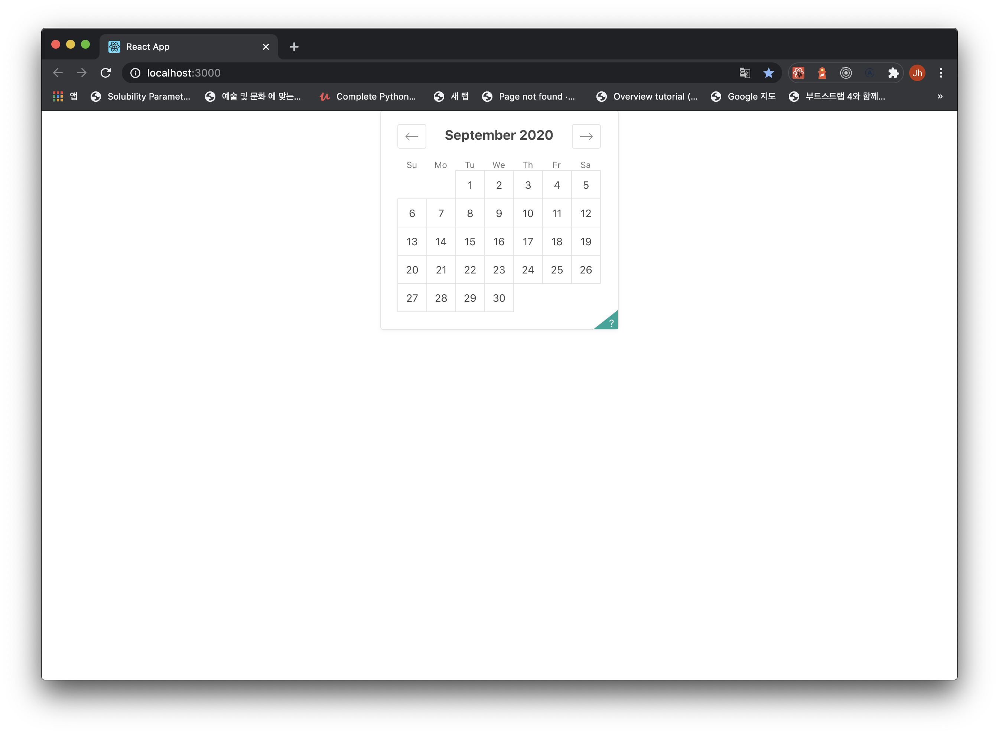

This project was bootstrapped with [Create React App](https://github.com/facebook/create-react-app).

## Creact-React-App
## react-dates (에어비앤비 달력 라이브러리)

- 간단히 달력 UI 만 마들어 보았습니다.
- 날짜 input 기능 들은 react-dates git 문서를 보며 커스터마이징 하셔야 합니다.

## ScreenShot

    

